# 화면 흐름도 - POS-Pricing Navigator

| 항목 | 내용 |
|------|------|
| **작성일** | 2026-05-13 |
| **참조 문서** | `main.prd` / `main-ipo.md` / `wireframe-spec.md` |
| **표기법** | Mermaid Diagram (마크다운 렌더러에서 자동 시각화) |

> Mermaid는 GitHub, VS Code, Notion 등 대부분의 마크다운 뷰어에서 자동 렌더링됩니다.

---

## 1. 전체 사이트맵 (화면 간 이동)

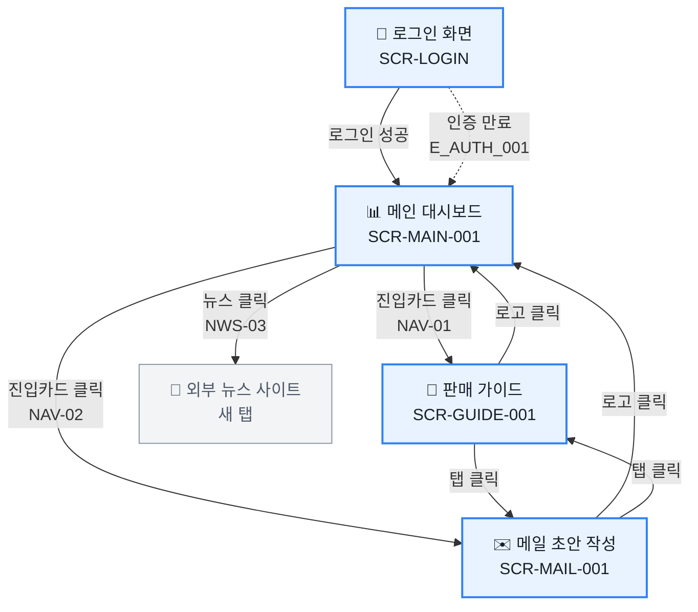

---

## 2. 메인 대시보드 진입 흐름 (P-01)

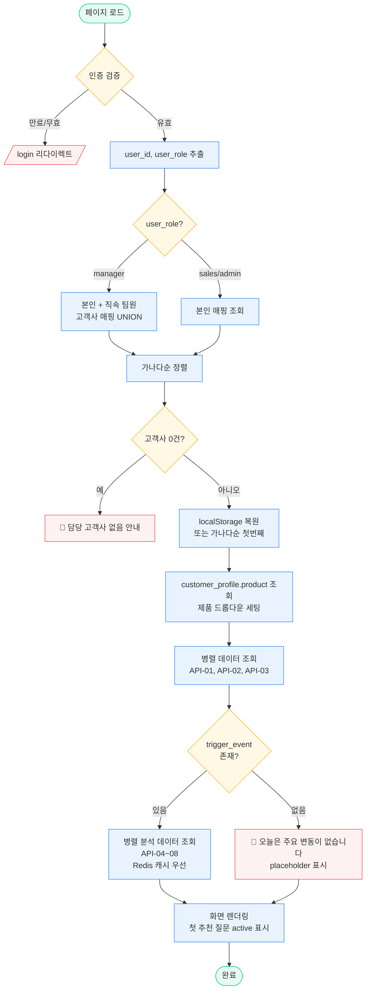

---

## 3. 사용자 이벤트별 흐름

### 3-1. 고객사 변경 흐름 (P-02)

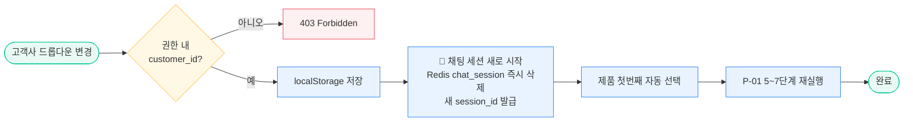

### 3-2. 제품 변경 흐름 (P-03)

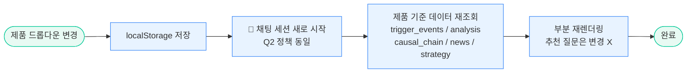

### 3-3. 새로고침 흐름 (P-04)

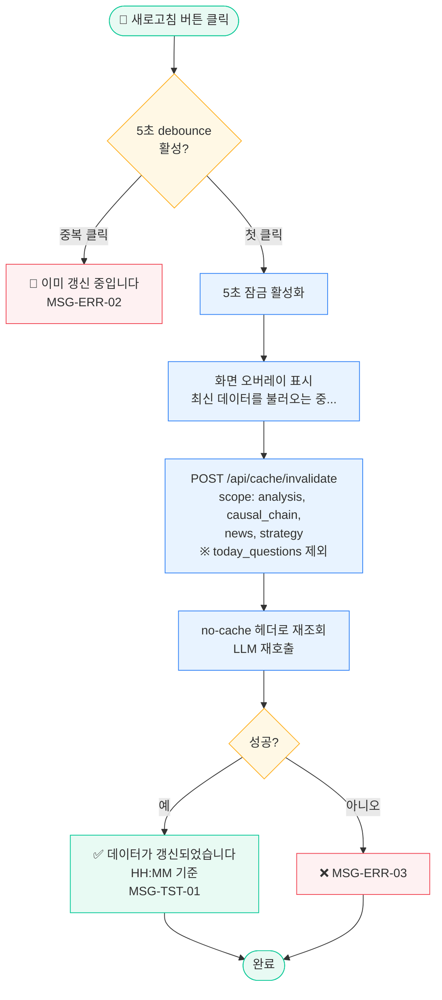

### 3-4. 추천 질문 선택 흐름 (P-05)

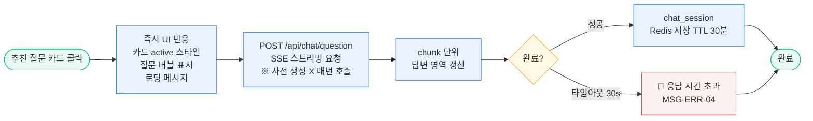

### 3-5. 채팅 질의 흐름 (P-06)

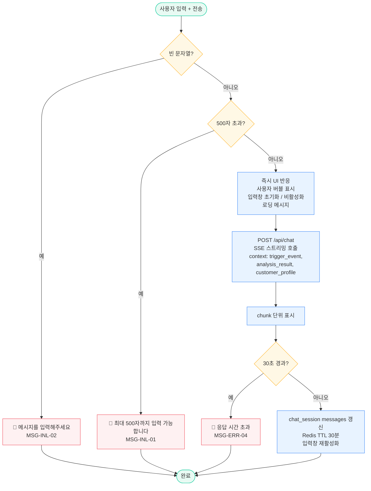

### 3-6. 뉴스 클릭 흐름 (P-07)

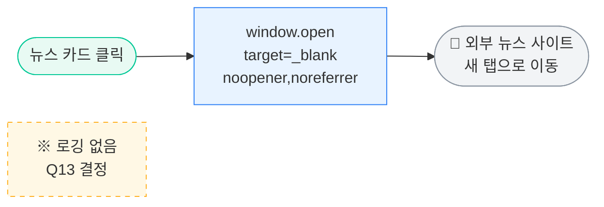

### 3-7. 화면 이동 흐름 (P-08)

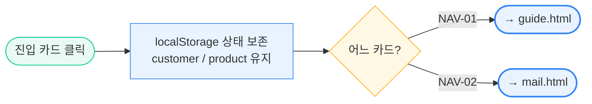

---

## 4. 일일 배치 흐름 (P-09)

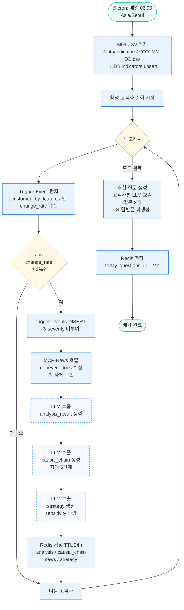

---

## 5. 상태 전환 다이어그램 (State Machine)

### 5-1. 메인 대시보드 상태

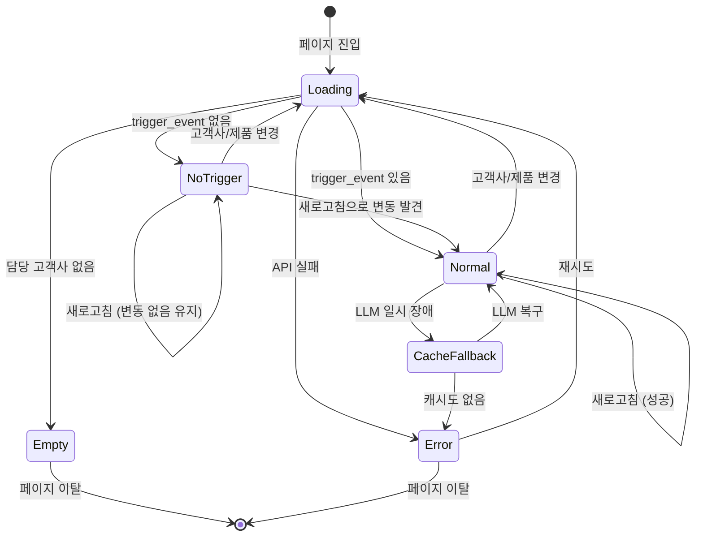

### 5-2. 채팅 세션 상태

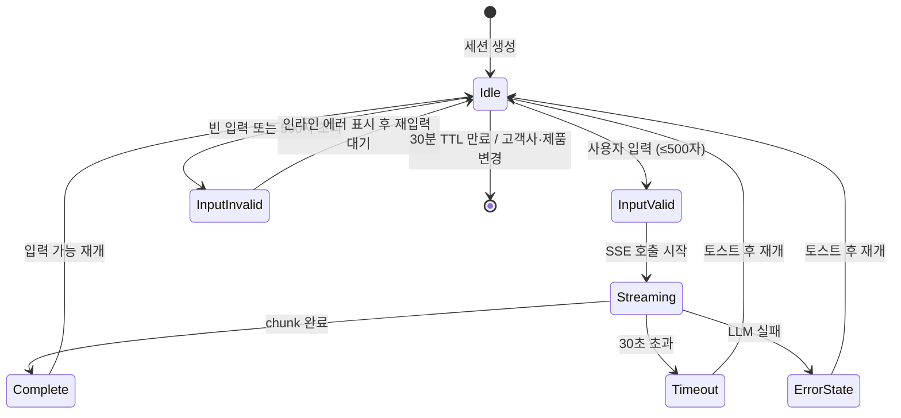

---

## 6. 에러 처리 흐름

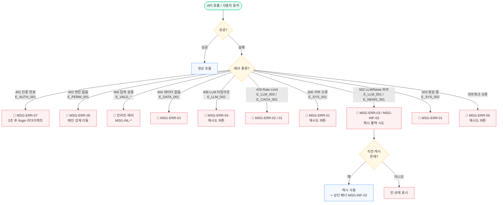

---

## 7. 캐시 정책 흐름

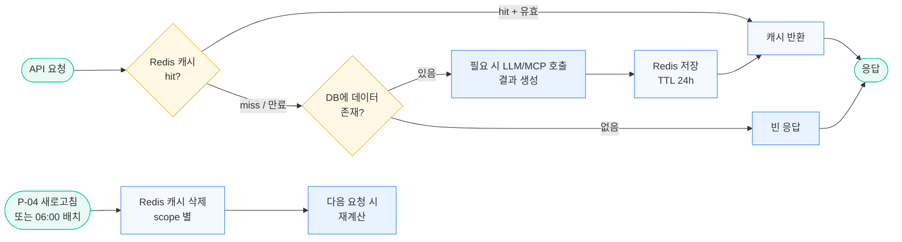

---

## 8. 권한 분기 흐름

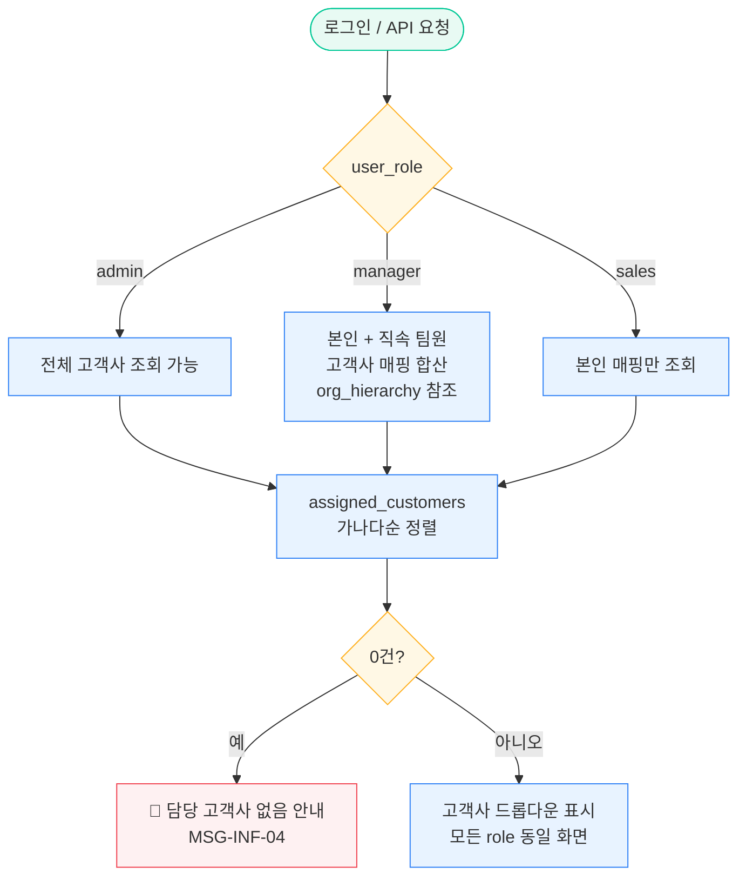

---

## 9. 변경 이력

| 버전 | 일자 | 변경 내용 |
|------|------|---------|
| v1.0 | 2026-05-13 | 최초 작성 (사이트맵 + Process P-01~P-09 + 상태/에러/캐시/권한 흐름) |
